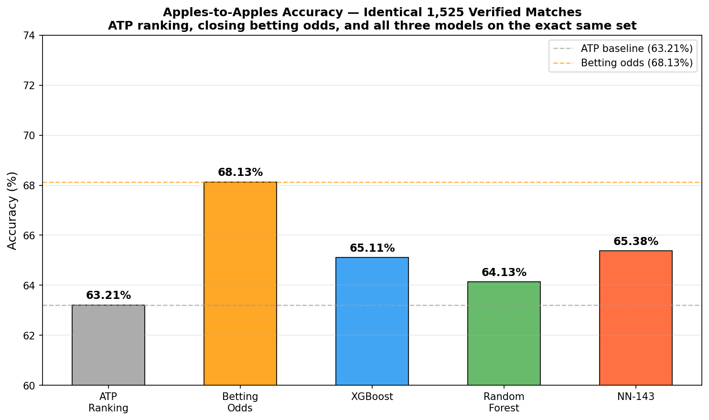

# Tennis Match Prediction System

A machine learning system for predicting professional ATP and Challenger tennis match outcomes. Trained on 900K+ historical matches (1990–2024) with strict temporal validation to prevent data leakage, and deployed as a live production pipeline tracking predictions against real Bovada odds.

## Performance

### Backtest — Full Test Set (~56K matches, 2023–2025 chronological holdout)

| Model | Accuracy | AUC-ROC | vs ATP Baseline |
|-------|----------|---------|-----------------|
| **Neural Network** | **66.4%** | **0.7282** | **+1.7 pp** |
| XGBoost | 66.3% | 0.7280 | +1.6 pp |
| Random Forest | 65.9% | 0.7238 | +1.2 pp |
| ATP Ranking Baseline | 64.7% | — | — |

### Live Production (300+ settled predictions against Bovada odds)

| Metric | Model | Market |
|--------|-------|--------|
| Overall accuracy | 60.6% | 64.1% |
| Challenger-level edge | +2.2% over market | — |
| High-confidence picks (75%+) | 85% | — |

The model is competitive with the market at Challenger level and when it has high conviction, but the market is sharper overall — especially at ATP level where lines are more efficient. Live tracking is ongoing across 4 model versions.



## Architecture

Three model types trained on identical leak-free data with chronological train/test splits:

- **Neural Network** — 5-layer MLP (128→64→32→16→1) with dropout and sigmoid output (deployed in production)
- **XGBoost** — gradient boosted trees (150 estimators, max depth 8)
- **Random Forest** — bagged ensemble (100 estimators, max depth 15)

### Features (141)

Features span current rankings, recent form, surface performance, head-to-head records, career stats, and match context. Key categories:

- **Rankings & points** — current ATP rank, rank volatility, points
- **Form** — win rates over 30/90/365-day windows, surface-specific form
- **Head-to-head** — career H2H record, recent H2H
- **Physical** — height, age, peak age delta
- **Context** — surface, tournament level, round, draw size, country
- **Temporal** — days since last match, match fatigue, season timing

Bayesian smoothing applied to rate-based features to handle sparse data. Features with insufficient data are flagged (not silently defaulted) and predictions with missing features are excluded from accuracy tracking.

## Data Sources

- **Historical match data**: 900K+ ATP/Challenger matches (1990–2024)
- **Live player data**: Tennis Abstract (current rankings, match history, player profiles)
- **Live odds**: Bovada (moneyline, spread, totals)

## Repository Structure

```
src/models/professional_tennis/   # Training scripts (preprocess, train_nn, train_xgb, train_rf)
production/                       # Live pipeline
  main.py                         #   End-to-end orchestrator
  auto_settle.py                  #   Auto-settle results from Tennis Abstract
  analyze_predictions.py          #   Accuracy, calibration, and edge analysis
  prediction_logger.py            #   Dedup-aware prediction logging
  odds/                           #   Bovada odds scraper
  features/                       #   Live feature computation (141 features)
  models/                         #   Model inference + versioned registry
  utils/                          #   Kelly staking, bet tracking
analysis_scripts/                 # Backtesting, calibration curves, Kelly simulation
results/professional_tennis/      # Evaluation outputs (model weights kept local)
data/                             # Historical match data (not committed)
```

Current docs to start from:

- `docs/production/README.md` for live pipeline and logging lineage
- `docs/production/VERSIONING.md` for model-family and logging-schema rules
- `docs/modeling/EXPERIMENT_WORKFLOW.md` for side-model tuning and walk-forward experiments

## Live Pipeline

The `production/` pipeline runs daily:

1. **Scrape** — Fetch upcoming ATP/Challenger matches and odds from Bovada (moneyline, spread, totals)
2. **Extract features** — Compute 141 features per matchup from Tennis Abstract (rankings, form, H2H, surface stats)
3. **Predict** — Run neural network inference, flag any matches with incomplete features
4. **Stake** — Calculate edges vs de-vigged market probabilities, apply fractional Kelly criterion
5. **Log** — Record predictions with full audit trail (model version, feature completeness, odds scrape timestamp, market start time)
6. **Settle** — Auto-settle completed matches by checking Tennis Abstract results, compute model vs market accuracy

Deduplication logic preserves opening odds when Bovada shifts match dates between runs. Predictions with defaulted features are excluded from accuracy analysis to ensure clean evaluation.

## Model Versions

| Version | Date | Features | Key Changes |
|---------|------|----------|-------------|
| v1.2.1 | 2026-03-24 | 141 | Fixed Masters detection, dynamic qualifier offsets |
| v1.2.0 | 2026-03-23 | 141 | Dynamic round-day offset heuristic |
| v1.1.1 | 2026-03-18 | 143 | Fixed surface experience cap bug |
| v1.1.0 | 2025-08-24 | 143 | Major feature engineering overhaul (+60 temporal features) |
| v1.0.0 | 2025-07-26 | 98 | Initial neural network model |

*Data files and model weights are not committed.*
