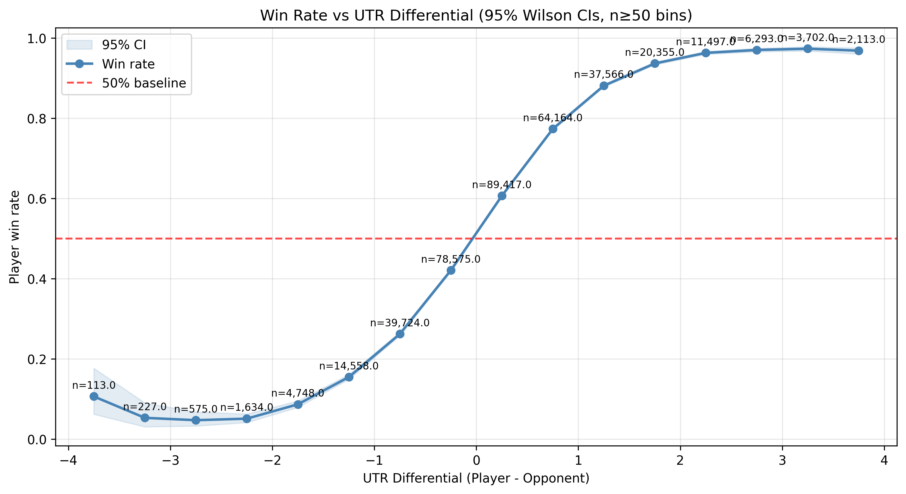
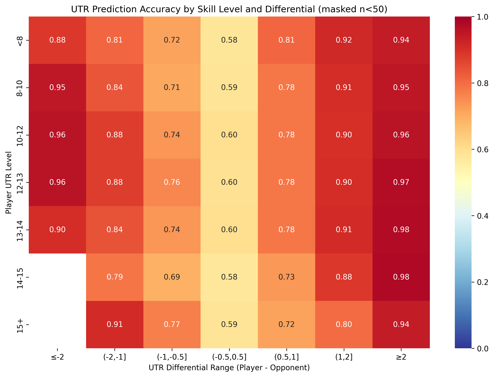

# UTR Analysis Results

Sample analysis results from production run on **August 23, 2025** with **378,401 matches**.

## Results Snapshot

- **Matches analyzed:** 378,401
- **Overall accuracy (higher-UTR wins):** 72.9%  
- **AUC:** 0.795  ·  **Brier:** 0.179  ·  **ECE:** 0.011  
- **By skill level:** <12 ≈ 79% · 12–14 ≈ 72% · 14+ ≈ 62%  
- **Time stability:** consistent across recent years  
- **Methodology:** pre-match UTRs; Wilson 95% CIs; bins with n<50 hidden

## Key Visualizations

  
  &nbsp;&nbsp;&nbsp;&nbsp;
  

*Win rate by UTR differential (left) and accuracy heatmap by skill level (right)*

## Detailed Findings

### Accuracy by UTR Level

| UTR Level | Accuracy | Sample Size | 95% Confidence Interval |
|-----------|----------|-------------|-------------------------|
| <8        | 75.24%   | 2,361       | 73.46% - 76.94%         |
| 8-10      | 75.65%   | 15,729      | 74.98% - 76.32%         |
| 10-12     | 75.53%   | 95,942      | 75.25% - 75.80%         |
| 12-13     | 74.54%   | 105,160     | 74.27% - 74.80%         |
| 13-14     | 72.99%   | 97,349      | 72.71% - 73.27%         |
| 14-15     | 65.26%   | 46,180      | 64.82% - 65.69%         |
| 15+       | 64.09%   | 15,680      | 63.34% - 64.84%         |

### Regression Analysis

| Level     | Matches | Coefficient | Intercept | Accuracy | Brier | AUC   |
|-----------|---------|-------------|-----------|----------|-------|-------|
| All       | 185,764 | 1.4964      | 0.076093  | 72.53%   | 0.179 | 0.795 |
| UTR < 12  | 53,359  | 1.4045      | 0.171794  | 79.03%   | 0.144 | 0.840 |
| UTR 12-14 | 106,917 | 1.5827      | 0.044080  | 71.65%   | 0.185 | 0.786 |
| UTR 14+   | 25,488  | 1.4711      | 0.000213  | 62.43%   | 0.229 | 0.671 |

## Key Insights

1. **UTR shows highest predictive accuracy at lower skill levels** (75%+ for UTR <12)
2. **Elite level prediction challenges** (UTR 14+) with ~65% accuracy  
3. **Temporal stability** confirmed across multiple years of data
4. **Wilson confidence intervals** provide robust statistical validation
5. **Train/test split methodology** ensures unbiased evaluation

## Dataset Summary

- **Total matches processed:** 378,401
- **Ties handled:** 1,860 (counted as 0.5 credit each)
- **Mean UTR:** 12.63 (range: 1.38-16.45)
- **Cross-reference tolerance:** ±30 days rating-to-match date
- **Validation approach:** Holdout test set with temporal splits

## Methodology Notes

**Higher-UTR Rule:** Predictions based on simple rule that player with higher UTR wins.
**Data Quality:** Only uses ratings ≤ match_date (prevents data leakage).  
**Statistical Rigor:** Wilson 95% confidence intervals, proper train/test splits.
**Reproducibility:** Full methodology documented in ARCHITECTURE.md.

## Sample Report

**Full interactive report:** [`analysis_output/utr_analysis_report.html`](./analysis_output/utr_analysis_report.html)

This static report includes all 13 visualizations, detailed methodology, and interactive statistical analysis.